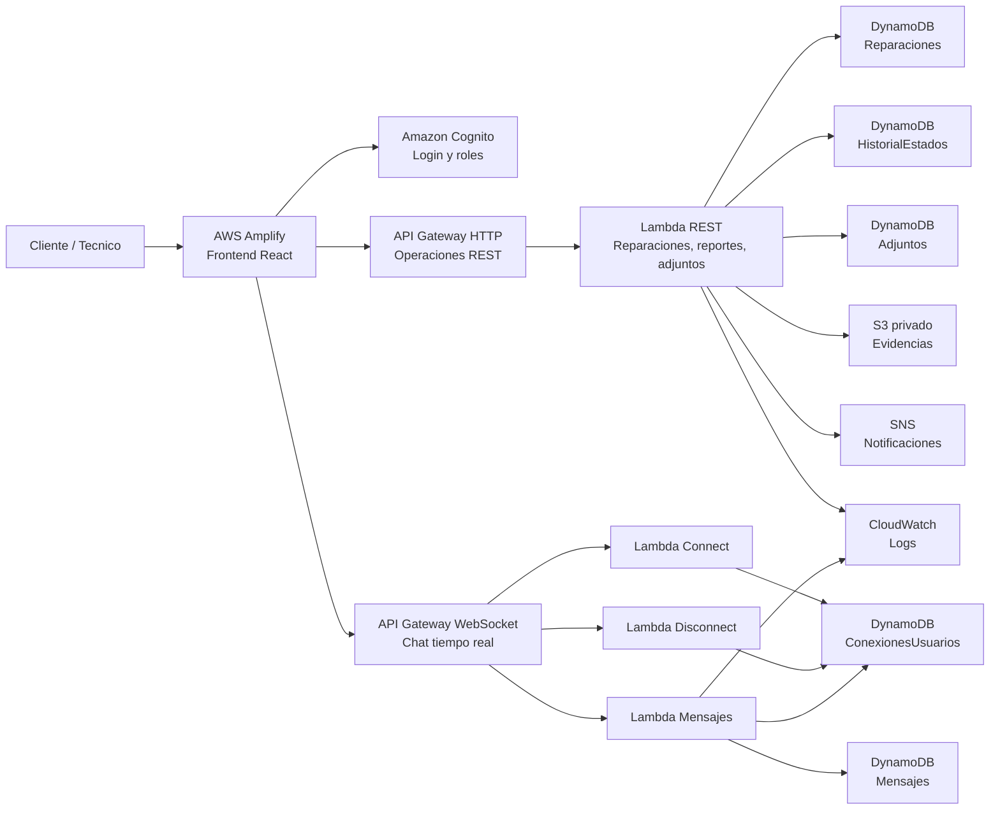

# Arquitectura AWS - TechRepair

## Flujo de reparaciones

1. El tecnico inicia sesion con Cognito.
2. El frontend envia una solicitud a API Gateway HTTP.
3. API Gateway valida el token Cognito.
4. Lambda REST crea o actualiza la reparacion.
5. DynamoDB guarda los datos.
6. Si el estado cambia a `Listo para retirar`, Lambda publica una notificacion en SNS.

## Flujo de chat

1. Cliente y tecnico abren el detalle de una reparacion.
2. El frontend abre una conexion WebSocket.
3. API Gateway WebSocket registra cada conexion en DynamoDB.
4. Al enviar un mensaje, Lambda lo guarda en `Mensajes`.
5. Lambda envia el mensaje a las conexiones activas de esa reparacion.

## Seguridad

- Cognito autentica usuarios.
- API Gateway HTTP exige token JWT.
- S3 no es publico.
- Las Lambdas tienen permisos IAM solo para los recursos que usan.
- Los clientes solo pueden ver reparaciones asociadas a su `clienteId`.
